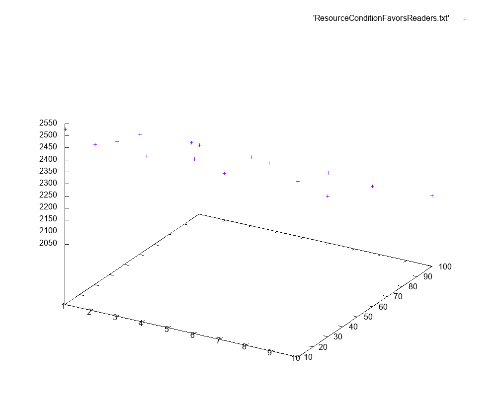
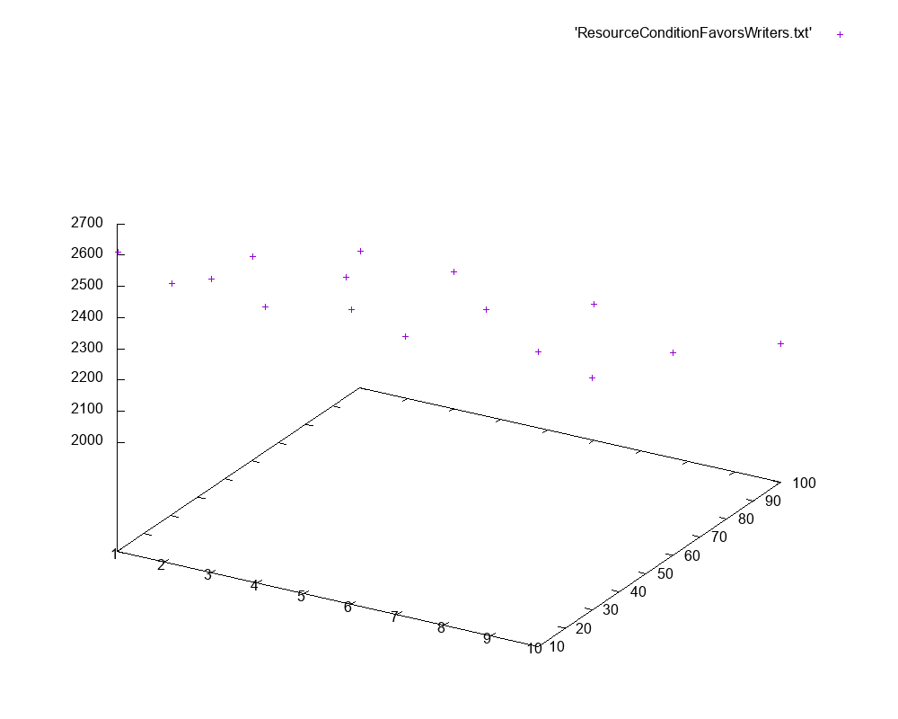
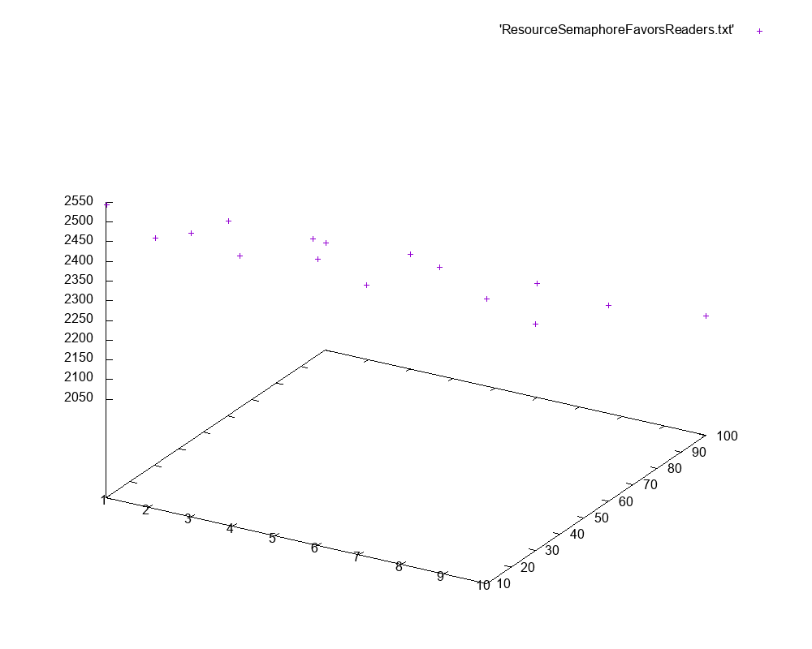
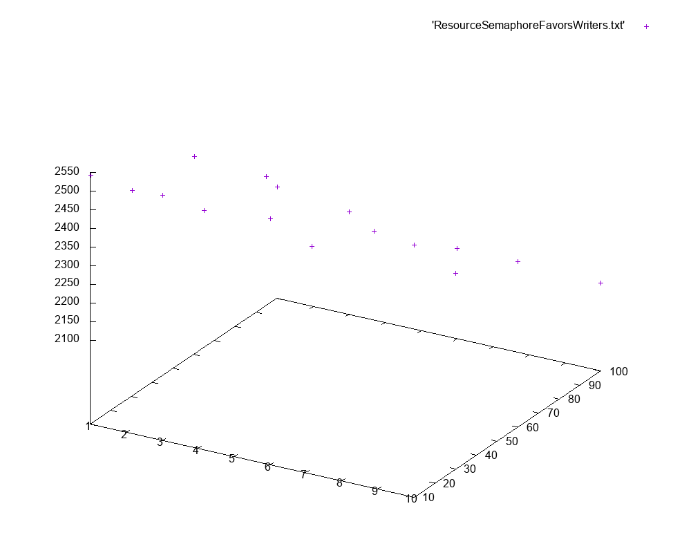
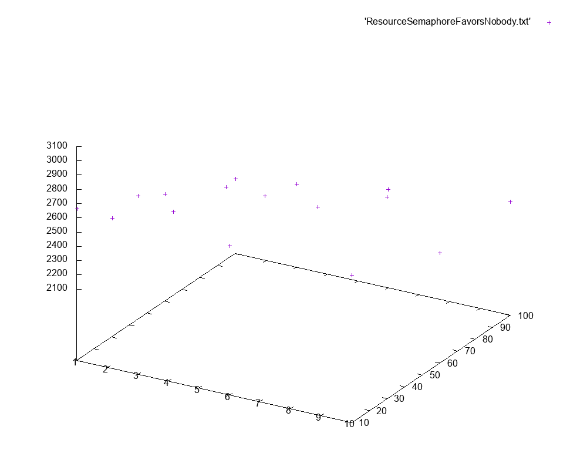

Kuba Walusiak, Juliusz Kościołek

24.04.2022

Laboratorium 4

# Mechanizmy synchronizacji w Java 2

## Polecenie 

Problem czytelników i pisarzy proszę rozwiązać przy pomocy:
* Semaforów
* Zmiennych warunkowych

Rozważyć przypadki z faworyzowaniem czytelników, pisarzy oraz z użyciem kolejki FIFO.

Proszę wykonać pomiary dla każdego rozwiązania dla różnej ilości czytelników (10-100) i pisarzy (od 1 do 10).

W sprawozdaniu proszę narysować wykres czasu w zależności od ilości wątków i go zinterpretować.

## Wykonanie

Kod programu jest dostępny w folderze [src/main/java/lab4](src/main/java/lab4). Stworzono interfejs `Resource` oraz 6 jego implementacji. Przetestowano każdą z nich w następujących warunkach:

- wolny pisarz (20ms)
- szybki czytelnik (10ms)
- sumarycznie 100 zapisów oraz 500 odczytów (podzielone pomiędzy czytelników i pisarzy)

Program zapisał wyniki do plików. Następnie, za pomocą programu gnuplot wykonano wykresy czytelnicy, pisarze -> czas dla każdej z implementacji.

```bash
ls Resource* | xargs -I {} gnuplot -e "set terminal png size 1000,800; set output '{}.png'; splot '{}'"
```

#### ResourceConditionFavorsReaders

Użyto mechanizmu `Condition`., Faworyzacja czytelników.

```
Writers 1 | Readers 10 | Duration 2526ms
Writers 3 | Readers 10 | Duration 2523ms
Writers 6 | Readers 10 | Duration 2523ms
Writers 10 | Readers 10 | Duration 2527ms
Writers 1 | Readers 30 | Duration 2379ms
Writers 3 | Readers 30 | Duration 2381ms
Writers 6 | Readers 30 | Duration 2380ms
Writers 10 | Readers 30 | Duration 2381ms
Writers 1 | Readers 60 | Duration 2298ms
Writers 3 | Readers 60 | Duration 2312ms
Writers 6 | Readers 60 | Duration 2299ms
Writers 10 | Readers 60 | Duration 2299ms
Writers 1 | Readers 100 | Duration 2087ms
Writers 3 | Readers 100 | Duration 2085ms
Writers 6 | Readers 100 | Duration 2092ms
Writers 10 | Readers 100 | Duration 2091ms
```



#### ResourceConditionFavorsWriters

Użyto mechanizmu `Condition`. Faworyzacja pisarzy.

```
Writers 1 | Readers 10 | Duration 2610ms
Writers 3 | Readers 10 | Duration 2592ms
Writers 6 | Readers 10 | Duration 2593ms
Writers 10 | Readers 10 | Duration 2592ms
Writers 1 | Readers 30 | Duration 2393ms
Writers 3 | Readers 30 | Duration 2386ms
Writers 6 | Readers 30 | Duration 2390ms
Writers 10 | Readers 30 | Duration 2389ms
Writers 1 | Readers 60 | Duration 2303ms
Writers 3 | Readers 60 | Duration 2304ms
Writers 6 | Readers 60 | Duration 2301ms
Writers 10 | Readers 60 | Duration 2300ms
Writers 1 | Readers 100 | Duration 2087ms
Writers 3 | Readers 100 | Duration 2089ms
Writers 6 | Readers 100 | Duration 2085ms
Writers 10 | Readers 100 | Duration 2094ms
```



#### ResourceConditionFavorsNobody

Użyto mechanizmu `Condition`. Kolejkowanie.

```
Writers 1 | Readers 10 | Duration 2616ms
Writers 3 | Readers 10 | Duration 2539ms
Writers 6 | Readers 10 | Duration 2548ms
Writers 10 | Readers 10 | Duration 2545ms
Writers 1 | Readers 30 | Duration 2383ms
Writers 3 | Readers 30 | Duration 2385ms
Writers 6 | Readers 30 | Duration 2379ms
Writers 10 | Readers 30 | Duration 2388ms
Writers 1 | Readers 60 | Duration 2300ms
Writers 3 | Readers 60 | Duration 2308ms
Writers 6 | Readers 60 | Duration 2313ms
Writers 10 | Readers 60 | Duration 2308ms
Writers 1 | Readers 100 | Duration 2090ms
Writers 3 | Readers 100 | Duration 2098ms
Writers 6 | Readers 100 | Duration 2094ms
Writers 10 | Readers 100 | Duration 2104ms
```


#### ResourceSemaphoreFavorsReaders

Użyto mechanizmu `Semaphore`. Faworyzacja czytelników.

```
Writers 1 | Readers 10 | Duration 2543ms
Writers 3 | Readers 10 | Duration 2519ms
Writers 6 | Readers 10 | Duration 2525ms
Writers 10 | Readers 10 | Duration 2522ms
Writers 1 | Readers 30 | Duration 2376ms
Writers 3 | Readers 30 | Duration 2378ms
Writers 6 | Readers 30 | Duration 2376ms
Writers 10 | Readers 30 | Duration 2373ms
Writers 1 | Readers 60 | Duration 2293ms
Writers 3 | Readers 60 | Duration 2296ms
Writers 6 | Readers 60 | Duration 2296ms
Writers 10 | Readers 60 | Duration 2296ms
Writers 1 | Readers 100 | Duration 2071ms
Writers 3 | Readers 100 | Duration 2091ms
Writers 6 | Readers 100 | Duration 2090ms
Writers 10 | Readers 100 | Duration 2102ms
```



#### ResourceSemaphoreFavorsWriters

Użyto mechanizmu `Semaphore`. Faworyzacja pisarzy.

```
Writers 1 | Readers 10 | Duration 2543ms
Writers 3 | Readers 10 | Duration 2531ms
Writers 6 | Readers 10 | Duration 2534ms
Writers 10 | Readers 10 | Duration 2550ms
Writers 1 | Readers 30 | Duration 2426ms
Writers 3 | Readers 30 | Duration 2416ms
Writers 6 | Readers 30 | Duration 2385ms
Writers 10 | Readers 30 | Duration 2397ms
Writers 1 | Readers 60 | Duration 2405ms
Writers 3 | Readers 60 | Duration 2394ms
Writers 6 | Readers 60 | Duration 2313ms
Writers 10 | Readers 60 | Duration 2318ms
Writers 1 | Readers 100 | Duration 2174ms
Writers 3 | Readers 100 | Duration 2150ms
Writers 6 | Readers 100 | Duration 2117ms
Writers 10 | Readers 100 | Duration 2108ms
```



#### ResourceSemaphoreFavorsNobody

Użyto mechanizmu `Semaphore`. Kolejkowanie.

```
Writers 1 | Readers 10 | Duration 2664ms
Writers 3 | Readers 10 | Duration 2851ms
Writers 6 | Readers 10 | Duration 2642ms
Writers 10 | Readers 10 | Duration 2628ms
Writers 1 | Readers 30 | Duration 2430ms
Writers 3 | Readers 30 | Duration 2572ms
Writers 6 | Readers 30 | Duration 2826ms
Writers 10 | Readers 30 | Duration 3012ms
Writers 1 | Readers 60 | Duration 2349ms
Writers 3 | Readers 60 | Duration 2494ms
Writers 6 | Readers 60 | Duration 2499ms
Writers 10 | Readers 60 | Duration 2368ms
Writers 1 | Readers 100 | Duration 2122ms
Writers 3 | Readers 100 | Duration 2180ms
Writers 6 | Readers 100 | Duration 2290ms
Writers 10 | Readers 100 | Duration 2394ms
```



## Interpretacja

Między poszczególnymi implementacjami można zauważyć widoczne różnice w czasie wykonania. Zaobserwowaliśmy m.in:

- przy większości implementacji, im jest więcej czytelników i pisarzy, tym czas wykonania jest krótszy
- implementacje kolejkujące wydają się wolniejsze od implementacji faworyzujących pisarzy lub czytelników 
- implementacja `ResourceSemaphoreFavorsNobody` nie wykazuje widocznego przyspieszenia wraz z większą ilością pisarzy i czytelników